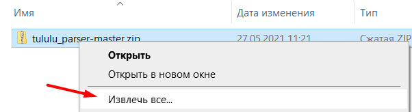
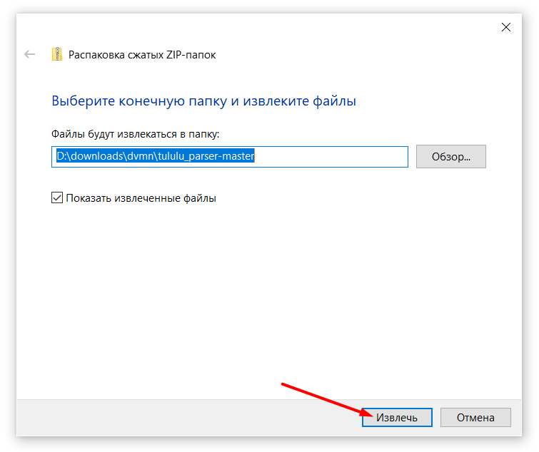
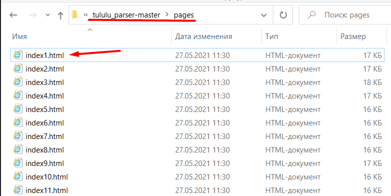

# Скачивание книг с tululu.org
[Онлайн-демо](https://n1k0din.github.io/tululu_parser/pages/index1.html)

## Как скачать и пользоваться офлайн-библиотекой
1. [Скачать актуальный архив](https://github.com/n1k0din/tululu_parser/archive/refs/heads/master.zip).

2. Распаковать скачанный архив.



3. Открыть библиотеку:
  - Перейти в папку `tululu_parser-master`.
  - Перейти в папку `pages`.
  - Открыть `index1.html`.
  
  - Наслаждаться коллекцией.

## Скрипты
- `tululu_parse.py` скачивает книги по id c tululu, текст и изображения обложек складывает в media/books/ и media/img/, данные о книгах хранит во внутреннем словаре. Пишет логи скачивания в `tululu_parse.log`.

- `parse_tululu_category.py` скачивает [фантастические книги](https://tululu.org/l55/)  по номерам страниц c tululu, текст и изображения обложек складывает в books и img (опционально, можно отключить скачивание) в указанной папке, данные о книгах хранит там же. Пишет логи скачивания в `tululu_category_parse.log`.

- `render_website.py` по данным от `parse_tululu_category.py` (описание книг, обложки, текст, и т.д.) создает [симпатичные html-страницы](https://n1k0din.github.io/tululu_parser/pages/index1.html) и запускает [локальный сайт](http://localhost:5500/pages/index1.html)


## Аргументы
### tululu_parse.py
- `start_id` идентификатор первой книги.
- `stop_id` идентификатор последней книги.

### parse_tululu_category.py
- `--start_page` номер первой страницы.
- `--stop_page` номер последней страницы, по-умолчанию вычисляется последняя существующая.
- `--dest_folder` папка для скачивания, по-умолчанию текущая.
- `--skip_imgs` пропускать скачивание изображений.
- `--skip_txts` пропускать скачивание текста.
- `--json_path` путь к файлу-результату, по-умолчанию `sci_fi_books.json`.

### render_website.py
- `--json` путь к исходному файлу с данными о книгах, по-умолчанию `sci_fi_books.json`.
- `--template` путь к файлу-шаблону, по-умолчанию `template.html`

## Пример запуска
- Скачивает книги с идентификатором от 5 до 100 включительно:
  ```bash
  python tululu_parse.py 5 100
  ```

- Скачивает фантастические книги со страницы 5 по страницу 10:
  ```bash
  python parse_tululu_category.py --start_page 5 --stop_page 10
  ```

- Скачивает все фантастические книги, начиная со страницы 690 в папку `download`, пропуская скачивание изображений:
  ```bash
  python parse_tululu_category.py --start_page 690 --skip_imgs --dest_folder download
  ```

- Рендерит входные файлы и запускает статический сайт:
  ```bash
  python render_website.py
  ```

## Пример результирующего файла
`sci_fi_books.json`
  ```json
  [{
    "author": "ИВАНОВ Сергей",
    "title": "Алиби",
    "comments": ["Детский вариант анекдотов про Шерлока Холмса)", "Загадки я люблю.)))", "А мне понравилось, люблю, знаете ли, всякие загадочки, головоломочки, кроссвордики, Гимнастика ума, одним словом... \nВо всём можно найти положительные моменты, не разгадал загадку, так хоть гренки научился готовить отменные... :-)", "Очень поучительное для ребенка 10 лет."],
    "genres": ["Научная фантастика", "Прочие Детективы"],
    "txt_path": ".\\media\\books\\239. Алиби.txt",
    "img_path": ".\\media\\img\\239.jpg"
  }, {
    "author": "Стерлинг Брюс",
    "title": "Бич небесный",
    "comments": ["Весьма интересная книга. Динамичный сюжет, насыщеный приключениями. Вмеру счастливый конец для главных героев. Оставляет чувство удовлетворения и завершенности. Немного коробит жаргон персонажей (пара выражений).", "книга супер!", "Книга потрясающая. С головой ушла в сюжет.", "Ну не знаю, я ожидала увидеть более грандиозное описание Ф-6, что-то такое, чтоб прямо дух захватило. Сюжет весь какой-то разорванный, собственно самим торнадо уделено очень мало внимания, а интимные подробности жизни бригадиров меня лично очень утомляли. Я несколько разочарована, ожидала большего.", "Уже прочитала пол книги- захватывает. Очень понравилось описание 2030 годов - по-моему именно к этому наш мир и катится.", "Мда... Думал будет типа фильма Смерч, но эта тягомотина, насчет истории героев, как заливали не понятную жижу в легкие!! Зачем лб этом писать, не понимаю. Или для того чтобы книга была побольше? Забили бы еще рекламой прокладок олвэйс... Зря время потратил.", "Сейчас буду читать, через 3 дня расскажу своё мнение...", "Супер ^_^."],
    "genres": ["Научная фантастика", "Триллеры"],
    "txt_path": ".\\media\\books\\550. Бич небесный.txt",
    "img_path": ".\\media\\img\\550.jpg"
  },
  ```


## Установка

### Подготовка скрипта

1. Скачайте код и перейдите в папку проекта.
    ```bash
    git clone https://github.com/n1k0din/tululu_parser.git
    ```  
    ```bash
    cd tululu_parser
    ```
2. Установите вирт. окружение.
    ```bash
    python -m venv venv
    ```
3. Активируйте.
    ```bash
    venv\Scripts\activate.bat
    ```
    или
    ```bash
    source venv/bin/activate
    ```
4. Установите необходимые пакеты.
    ```bash
    pip install -r requirements.txt
    ```
5. Скачайте необходимые книги, например, первые 10 страниц научной фантастики:
    ```bash
    python parse_tululu_category.py --stop_page 10
    ```
6. Отрендерите статический сайт
  ```bash
  python render_website.py
  ```
7. Наслаждайтесь по адресу http://localhost:5500/pages/index1.html

### Цель проекта

Код написан в образовательных целях на онлайн-курсе для веб-разработчиков [dvmn.org](https://dvmn.org/).
